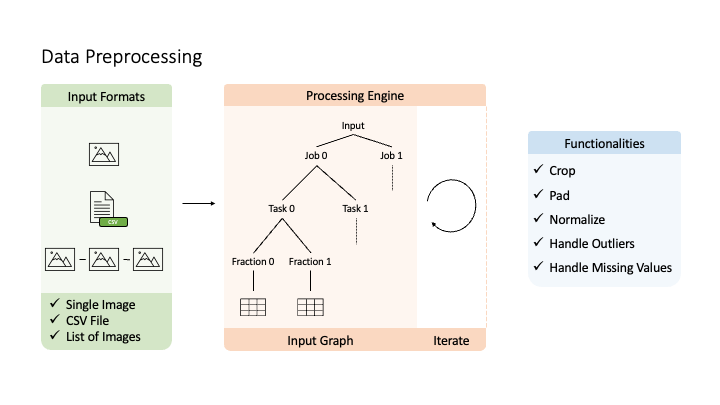
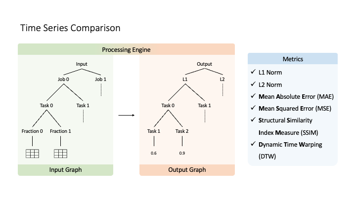

# Time Series Comparison for Google's 2019 Trace Dataset

[](https://opensource.org/licenses/MIT)

This repository contains a collection of tools that allows to collect, manipulate
and finally compare time series provided by Google's trace dataset (2019).

The repository is essentially a Python package that can be installed and used in
any Python scirpt. Once it is installed, it also offers a command line interface
(CLI) with limited capabilities (download and store Google's trace dataset mainly).

## Repository Structure

- `docs/`: instructions and examples on how to use the offered tools
- `gtd/`: source code
    - `cli/`: implementation of the CLI
    - `comparator/`: components and metrics for time series comparisons
    - `input/`: readers of different types of inputs (numeric data, images, etc.)
    - `internal/`: abstractions and components of the processing engine
    - `preprocessor/`: components for data preprocessing and feature engineering

## Installation

To install the Python package follow the [installation](docs/installation.md) instructions.

## Data Collection & Storage

**Option A**:

Follow the [collection](docs/data_collection.md) and [storage](docs/data_storage.md)
instructions to download and store Google's trace dataset.

**Option B**:

Use the sample dataset of the provided [demo](docs/demo/).

## Usage

### Read Input

The tool accepts multiple input types such as CSV files or images and can easily
be extended.

The supported types can be found in the [input module](gtd/input/).

```python
from gtd.input import CsvFullReader

inp = CsvFullReader(input_dir='./input', structured=True, columns=['time', 'avg_cpu_usage']).read_input()
```

### Preprocess Data



After reading the input, the tools offers multiple data preprocessing and feature
engineering steps such as normalization or image creation.

The supported steps can be found in the [preprocessor module](gtd/preprocessor/).

```python
...
from gtd.preprocessor import TaskNormalizer, FractionGADFCreator

...
normalized_tasks = TaskNormalizer(col='avg_cpu_usage').run(inp)
img_fractions = FractionGADFCreator(col='avg_cpu_usage', image_size=256).run(normalized_tasks)
```

### Compare Time Series



Once you transform the input in the desired format you can use one of the available
comparison methods for numeric data or images.

The supported comparison methods can be found in the [comparator module](gtd/comparator/).

```python
...
from gtd.comparator import (
    L2ImageTaskFractionComparator,
    SSIMImageTaskFractionComparator,
)
from gtd.internal import Output

...
out = Output()

L2ImageTaskFractionComparator(name='l2').compare(img_fractions, out)
SSIMImageTaskFractionComparator(name='ssim').compare(img_fractions, out)
```

## Demo

For a complete example check out the demo notebooks under the [demo folder](docs/demo/)

## Paper Reference

Georgia Christofidi, Konstantinos Papaioannou, and Thaleia Dimitra Doudali.

2023\. Toward Pattern-based Model Selection for Cloud Resource Forecasting.

In 3rd Workshop on Machine Learning and Systems (EuroMLSys ’23), May 8, 2023, Rome,
Italy.

ACM, New York, NY, USA, 8 pages. <https://doi.org/10.1145/3578356.3592588>

## Acknowledgement

This work is part of the grant FJC2021-047102-I, funded by MCIN/AEI/10.13039/501100011033 and the European Union «NextGenerationEU»/PRTR


